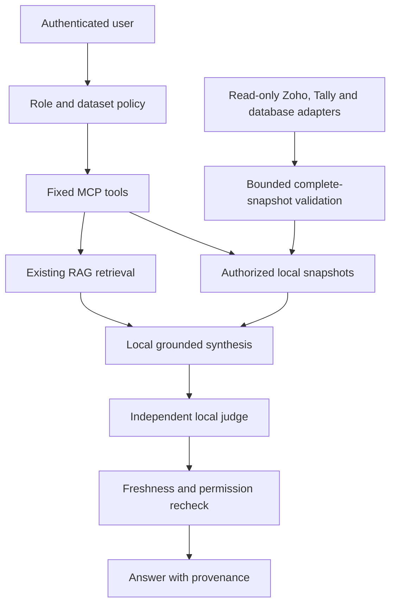

# Connecting enterprise systems — release 0.2.0

This release preserves the RAG backend and adds read-only source synchronization. Connection code is included; your Zoho account, Tally installation and private databases have not been accessed or live-tested. Enable sources only after configuring and checking their grants, network paths, fields and ACLs. All examples start disabled.

## Supported connections

| System | Implemented adapter | Required configuration |
|---|---|---|
| Zoho Books | Regional OAuth; paginated v3 approved resources | Organization ID, regional client and read-scoped refresh token |
| Zoho CRM | v8 modules, selected fields, continuation tokens | Approved standard/custom module and read-scoped token |
| Zoho Analytics | v2 synchronous selected-column table export | Organization, workspace and view IDs; data-read permission |
| Other Zoho applications | Administrator-approved regional REST GET mappings | Product-specific endpoint, read scopes, fields and explicit pagination contract |
| TallyPrime | Fixed XML collection exports: ledgers, vouchers, stock items | Loaded company; private XML server/tunnel |
| PostgreSQL / ShaktiDB | SQLAlchemy + psycopg | Read-only account, verified TLS, approved view/query |
| MySQL / MariaDB | SQLAlchemy + PyMySQL | Read-only account and CA-verified TLS |
| SQL Server | SQLAlchemy + pyodbc | Microsoft ODBC Driver 18; verified encrypted connection |
| Oracle | SQLAlchemy + oracledb | Verified TCPS configuration and read-only account |
| SQLite | Read-only approved local file | Explicit file allowlist |
| MongoDB | Fixed filter and projection | Read-only user, approved seeds and verified TLS |
| Additional databases | Reviewed local Adapter implementation | Driver, schema mapping, network policy and adapter tests |

There is no universal connection without a driver and a schema/API contract. Zoho products do not share one database API: Books, CRM and Analytics have native adapters; other products require their own reviewed REST mapping or Adapter. Analytics async exports, live-connect/query tables and dashboard exports are outside the synchronous adapter. It refuses oversized/unsupported responses rather than presenting partial data as complete. This package does not implement enterprise application writes.

## 1. Install and migrate

Follow SETUP.md first. Existing EAIL 0.1.0 installations must run `sql/migrations/002_connectors.sql` against the **EAIL database** as its administrator before starting upgraded processes. On SQLite:

```bash
python - <<'PY'
from pathlib import Path
from src.database import db
with db.connect() as conn:
    conn.executescript(Path('sql/migrations/002_connectors.sql').read_text())
PY
```

For PostgreSQL/ShaktiDB, apply the migration using your private administrator connection through psql and grant runtime SELECT/INSERT/UPDATE/DELETE on `eail_sync_state`, `eail_sync_runs` and `eail_source_records`. The updated `sql/bootstrap_roles.sql` is the role example for new installations. Do not grant source-system writes or recreate your existing RAG tables. Back up before migration; keep the old application isolated as described in MIGRATION.md.

```bash
pip install -r requirements.txt
# Install only required optional drivers; requirements-connectors.txt lists them.
pip install PyMySQL pymongo
cp config/connectors.example.json config/connectors.json
chmod 600 config/connectors.json .env
```

SQL Server also needs the system ODBC driver; Oracle needs an appropriate server TCPS/certificate configuration. On the small EC2 host, run one sync worker and one inference request at a time. Configure an approved company view when raw data exceeds the bounded snapshot limits.

## 2. Configure Zoho

Choose the account's actual data center in each source's `region`, and supply organization/workspace/view IDs in the catalog. Create client credentials and read-only OAuth grants for each product through Zoho's supported authorization flow. Examples include `ZohoBooks.invoices.READ`, the relevant `ZohoCRM.modules.*.READ` scopes and Analytics data-read permission; confirm exact scopes for your selected endpoints and account. Separate product refresh tokens are supported. Keep token consent/issuance outside EAIL and never place tokens in chat or source files.

Populate the matching environment names from `.env.example`: client ID, client secret and product refresh tokens. The catalog contains environment references only. To enable encrypted persistent OAuth caching, privately run:

```bash
python scripts/generate_connector_key.py
```

Store the generated value as `ZOHO_TOKEN_CACHE_KEY` in the mode-600 `.env`; do not commit or log it. The cache stores Fernet-encrypted access tokens with a private lock and atomic replacement, reducing repeated refreshes across sync processes. Protect the cache key as a secret and include it in your managed secret rotation policy. Rotating credentials changes the catalog fingerprint and requires a fresh synchronization.

Enable the relevant source and dataset by setting both `enabled` values to `true`. Review `fields`, five-field metadata, roles, owner, clearance, row ACL mappings, limits and freshness for every dataset. Example Finance permissions are templates, not your approved policy. Other Zoho products use `zoho_rest` only with an approved region host, fixed GET path and response/pagination mapping. A non-paginated endpoint needs explicit `single_response_complete: true`; do not declare this for a paginated endpoint.

Zoho is a cloud source. Scheduled reads contact Zoho APIs; AI inference and judging remain local, and conversational questions are not sent to Zoho. If your policy requires source data never to leave an on-premise system, use an approved internal Zoho export/mirror instead of a cloud connector.

## 3. Configure TallyPrime

The documented compatibility target is TallyPrime 7.1, listed by Tally as released 20 May 2026. The adapter uses its documented XML integration interface; this is not a claim of a live-tested 7.1 installation. Enable Tally's XML/HTTP server through the settings appropriate to your edition, load the exact approved company and verify an export locally. Match the configured port, commonly 9000.

Set `TALLY_URL=http://127.0.0.1:9000` and `TALLY_COMPANY` to the exact loaded company name. If Tally runs on Windows and EAIL on Ubuntu, a private authenticated tunnel can carry the local XML endpoint. For example, from the Tally host with a provisioned SSH key and verified Ubuntu host key:

```bash
ssh -N -R 127.0.0.1:9000:127.0.0.1:9000 ubuntu@EAIL_PRIVATE_HOST
```

Choose an unused tunnel port if necessary and change TALLY_URL accordingly. Restrict the SSH account's forwarding permissions and use your private network/firewall policy. Raw remote HTTP is refused; a reviewed HTTPS gateway with an explicitly approved host is another supported route. Do not expose Tally's XML port publicly.

Enable `tally-prime` and reviewed Tally datasets. Vouchers require an explicit monthly sync period. Fixed TDL collection exports contain no Import requests; voucher ledger entries are retained. Native balance signs and Dr/Cr strings are preserved, so the platform does not invent currency/sign conversions or treat ledger master balances as historical monthly results. Verify collection fields, dates, stable GUIDs, company access and totals against your actual edition before enabling business use. Tally ODBC and JSON adapters are not included.

## 4. Configure a database

Set `SOURCE_DATABASE_URL` privately, using the required SQLAlchemy driver, verified TLS options and a dedicated SELECT-only source account. Restrict network egress and allowlist the exact source hosts in the catalog; MongoDB cluster member discovery also needs appropriate firewall rules. Confirm actual source privileges before enabling `readonly_credentials_confirmed`. This flag records operator confirmation; it cannot prove server-side grants.

Place one reviewed, explicitly projected SELECT under `config/sql/`; the included `budget.sql` expects an administrator-provided `approved_budget_view`. It is not your existing schema. Configure its dataset's fields, stable ID, period, currency, units and ACLs. Parameters are bound; SQL AST checks reject writes, multiple statements, wildcard projections, locks and SELECT INTO. The model cannot generate executable SQL or choose a database URL.

`sum_decimal` sums an approved projected field by currency. `difference_decimal` computes field minus baseline, then sums by currency; both inputs must be finite plain decimals. Minor/major units must be explicit. Tally Dr/Cr representations are refused for such arithmetic until a reviewed normalization is supplied. Never sum mirrored Zoho and Tally records as distinct business transactions: designate an authoritative source and reconcile source IDs, calendars and accounting definitions.

For another database, implement `Adapter.fetch(dataset, period)` and register a trusted class in `src/connectors/extensions.py`. Return a complete bounded snapshot or raise; enforce read-only credentials, approved destinations, timeouts and pagination in the adapter. Restart after code review. Dataset configuration cannot load arbitrary modules. The common publisher enforces projected fields, row/byte bounds, unique stable IDs, ACLs and atomic publication.

## 5. Synchronize and query

```bash
python scripts/sync_sources.py --dataset zoho-invoices
python scripts/sync_sources.py --dataset tally-ledgers
python scripts/sync_sources.py --dataset tally-vouchers --period 2026-09
python scripts/sync_sources.py --dataset enterprise-budget --period 2026-09
```

Each source fetch runs in an isolated worker with a 60-second wall timeout. Limits are ceilings, not truncation: incomplete pagination, duplicate/missing IDs, changed policy or oversized results abort the publication. A successful transaction publishes a new local generation. Failed syncs retain the previous complete snapshot; it is served only within its freshness window and carries a warning. Expired snapshots are refused.

An authenticated user can discover only permitted datasets through `GET /sources`, inspect `GET /sources/{dataset_id}/records?period=2026-09`, or send this body to `POST /ask` with their private bearer token:

```json
{"question":"Summarize invoices for 2026-09","dataset_id":"zoho-invoices","mode":"reasoned"}
```

The CLI accepts `/source zoho-invoices Summarize invoices for 2026-09`. MCP exposes the fixed `source_records` tool. Dataset and record permissions are checked before records enter model context; approved aggregates use authorized records only. Synthesis retains the independent judge and numerical checks, and rechecks policy, snapshot generation and freshness before returning. Large record responses explicitly indicate truncation while measures operate on the full authorized snapshot.

For scheduled reads, review `sync_periods` on period-scoped datasets and the new `deploy/eail-sources.service`. Follow SETUP.md's systemd installation pattern and adjust paths/user before enabling it. The worker defaults to a bounded 900-second interval, processes sources sequentially and does not execute enterprise writes. Operational runs are recorded in `eail_sync_runs`; metadata-only ingestion logs contain status and counts, not tokens or record bodies.

## Architecture and rollout checks



Before rollout, verify one small dataset per source against vendor totals, stable IDs, pagination completion, dates, currencies, ACL-denial cases, token renewal, source outages and freshness expiry. Run local tests and then your live integration checks. Pin resolved dependency versions with `scripts/create_lock.sh`, scan those versions through your organization's tooling and test updates in staging. Use your established TLS ingress, secret manager, backup/restore, monitoring and IdP policy. This reference code has no security certification and has not replaced your organization's production review.

## Official references

- [Zoho Books OAuth and regional access](https://www.zoho.com/books/api/v3/oauth/)
- [Zoho CRM v8 record pagination](https://www.zoho.com/crm/developer/docs/api/v8/get-records.html)
- [Zoho Analytics v2 exports and limitations](https://www.zoho.com/analytics/api/v2/bulk-api/export-data.html)
- [TallyPrime 7.1 release notes](https://help.tallysolutions.com/release-notes-tallyprime-7-1/)
- [TallyPrime integration interfaces](https://help.tallysolutions.com/integrate-with-tallyprime/)
- [SQLAlchemy connections](https://docs.sqlalchemy.org/en/20/core/connections.html)
