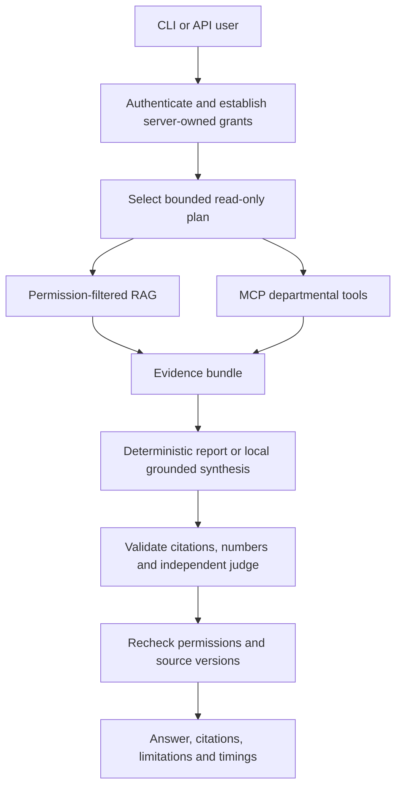

# How EAIL works

## 1. It adds intelligence above existing systems

EAIL has two evidence paths: documents and structured business records. The orchestrator combines them when needed. All arithmetic runs in deterministic code. The LLM interprets ambiguous requests and explains evidence; it does not receive a database password, arbitrary SQL executor, shell executor, or approval capability.

## 2. Document ingestion

1. Read only regular direct-child files from `documents/`; reject symlinks and unsupported extensions.
2. Read and validate explicit `.meta.json` access metadata.
3. Check file size, signatures, archive paths, encryption and expansion limits.
4. Hash the bytes. If unchanged, refresh ACL metadata without rebuilding embeddings.
5. Copy the exact source snapshot into a private temporary directory.
6. Run extraction in a separate process with a wall-clock timeout and Linux CPU/address-space limits.
7. Extract paragraphs, pages, slides, spreadsheet rows or OCR text. Scanned PDFs use PDFium rendering plus Tesseract.
8. Chunk using the retained 1000-character / 200-character-overlap defaults.
9. Produce normalized local MiniLM vectors, reusing the loaded model per process.
10. Recheck source bytes/ACLs and transactionally replace chunks. Extraction/embedding failure preserves the previous chunk transaction.

Old chunks preserved after a failed update are not blindly served: retrieval suppresses them if the current file hash or ACL no longer matches the indexed snapshot. Deletion deactivates documents; invalid/missing metadata also deactivates them. This prioritizes accurate authorized answers over stale availability.

## 3. Retrieval

Read document metadata first, filter by department, clearance and ACL, and only then load permitted chunks. Compare vector similarity and keyword overlap, exclude detected injection chunks, and retain Top-K 10 by default. Before releasing an answer, recheck file hashes and permissions.

The initial index is ordinary database rows containing JSON vector arrays. This preserves ShaktiDB portability without requiring pgvector. Search scans permitted vectors and checks source hashes: appropriate for small indexes, not enterprise-scale performance. Introduce a tested permission-aware vector index as corpus size grows; do not replace ACL filtering with post-answer redaction.

## 4. Authentication and access

`Principal` is immutable server-owned identity state. A token hash or verified private-SSO subject maps to roles and department grants in `config/users.json`. Client requests cannot choose their own role.

A record is readable only when:

- its department is allowed (or explicitly `Public`),
- its classification is within clearance,
- any additional user/role restriction passes.

Record ownership does not bypass classification/department requirements. HR can restrict individual employee records using `allowed_users`. Titles such as CEO or CFO do not imply unrestricted HR access.

## 5. Planning and local MCP

Clear analytics questions with explicit periods use a fast deterministic route, avoiding a planner model call. Ambiguous analytics questions use a local structured-output planner, whose result must match the tool allowlist, authorized departments, and explicit reporting period. Plans allow at most seven department reads; no recursive agent loop is implemented.

The gateway starts a fixed internal `src.mcp_server` process and negotiates MCP initialization. Messages are actual JSON-RPC `initialize`, `notifications/initialized`, `tools/list` and `tools/call` messages over newline-delimited stdio. The trusted gateway supplies an opaque credential through the subprocess environment; the model never receives it. The MCP server authenticates it again and independently checks each call.

This internal MCP server reads EAIL's normalized departmental facts. It does not pretend to be connected to your existing ERP/HR/procurement installation. For those systems, the included read-only export adapter provides one concrete integration pattern. Normalize approved source data, import it transactionally, and retain source IDs/timestamps. Replace the adapter with private authenticated application-specific connectors when schemas and APIs are available.

Each MCP call launches one process in this release. A persistent session pool can reduce overhead after authorization/session-isolation tests are in place. This release exposes local stdio, not a public remote MCP transport.

## 6. Structured intelligence

- `budget_variance`: actual minus budget, grouped by recorded category; report percent relative to budget.
- `department_summary`: authorized records for one department and period, with truncation disclosed.
- `budget_scenario`: a hypothetical uniform change in recorded actual spending.
- `forecast_spend`: three-month moving-average spending baseline with six complete consecutive historical months and a three-observation rolling mean-absolute-error backtest.

Amounts use integer minor currency units and Decimal calculations. Mixed currencies are rejected; no guessed currency conversion occurs. Forecasts disclose assumptions and are not asserted to be production-validated predictive models. Missing/restricted historical months prevent a forecast.

The default Finance fixture contains INR 150,000 budget and INR 175,000 actual. Variance is INR 25,000, or 16.67%. The Procurement fixture uses the same synthetic amounts independently.

## 7. Answer validation

Reasoned synthesis receives a bounded evidence bundle with source IDs. It must return structured JSON with answer, citation IDs and a not-found flag. EAIL validates fields, citation existence, numeric tokens and injection patterns, then sends the candidate to a separately configured local judge.

Judge metrics preserve context relevance, answer relevance, grounding, completeness, hallucination flag and overall score. Acceptance requires grounding, no detected hallucination, overall score at least 0.70, and answer relevance at least 0.70. Failed candidates receive at most one stricter regeneration. Unsupported explanations fall back to not-found; any available deterministic analytics remain separately visible.

The retained fast path is explicitly selected evidence-copy mode. It skips generation and judging because it returns the retrieved passage labeled as an excerpt. It never claims word overlap proves a correct answer. Deterministic numeric reports also skip LLM judging because their calculation path is executable and tested. No validator or model judge guarantees absence of every hallucination.

A partial connector failure is recorded and disclosed. A changed role, ACL, source or normalized fact is rejected at the final recheck; the user must ask again. No answer cache is implemented, avoiding stale permission reuse in this initial release.

## 8. Approval workflows

The implemented action is local follow-up task creation. A user proposes an action with an idempotency key. Another authorized approver executes it. Status transition, task creation and final status update occur in one DB transaction. Unique constraints and conditional updates prevent duplicate execution.

There are no autonomous payment, procurement approval or employee-record mutations. Such integrations require specific action adapters, business policies, approval records and recovery design; they must not be inferred from a generic MCP tool.

## 9. Logs and operational controls

Four rotating JSONL logs retain metadata only:

- `rag.log`: operational errors.
- `audit.log`: request IDs, identity, tool names, metrics, approvals and timings.
- `security.log`: rejected requests and validation failures.
- `ingestion.log`: ingestion states, versions, counts and durations.

Raw questions, documents, answers, tokens and DB URLs are not logged by application code. Systemd applies a restrictive umask and filesystem/process protections. Logs are local rotating files, not immutable enterprise audit storage: central protected collection and retention are deployment responsibilities.

The small-host configuration admits one inference request at a time and returns busy for another. Extraction runs in a separate watcher process. Global admission control and rate limits must move to shared infrastructure before adding multiple API workers or hosts.

## Freshness timestamps

Structured `updated_at` is the EAIL synchronization timestamp. Optional `source_updated_at` retains a supplied authoritative-source timestamp; an empty string means it was not supplied. Answers must not interpret synchronization time as proof the upstream business record was recently updated. Source adapters should provide timezone-aware source timestamps and preserve stable IDs.
